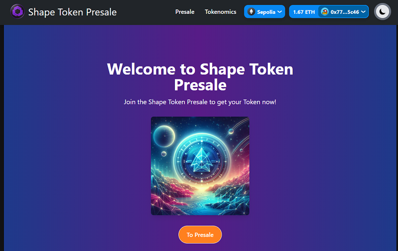
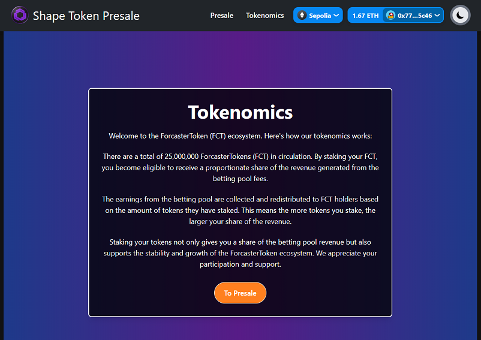
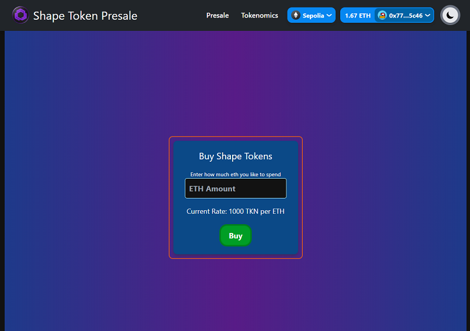

# presale dapp

* landing

* infopage

* presale page

## install using

nvm use 20.12.2
yarn
yarn dev

## presale contract
Token: 0x763F016d03eEa2653debB688D15C80583A6421E1
Presale:0xE9d667b42F94907fD39296c177e8aB0f4e3033a8
alow presale contract to spend token and transfer token to swap contract

Token:https://sepolia.etherscan.io/address/0x763F016d03eEa2653debB688D15C80583A6421E1#code
Presale:https://sepolia.etherscan.io/address/0xE9d667b42F94907fD39296c177e8aB0f4e3033a8#code
---

### Web3 Packages

- [ethers](https://docs.ethers.org/v5/)
- [rainbowkit](https://www.rainbowkit.com)
- [wagmi](https://wagmi.sh)

## Presale DApp Information

This is a simple presale DApp (decentralized application) for selling ERC20 tokens. Here's how it works:

1. **Token Deposit**: The token seller deposits the ERC20 tokens they want to sell into the presale contract.

2. **Token Pricing**: In the presale contract, the seller sets the initial token price. For example, 1 ETH might buy 1,000 tokens.

3. **Presale Phase 1**: During the first 30 days of the presale, the initial token price is in effect. Buyers can send ETH to the contract and receive the corresponding number of tokens directly in their wallets.

4. **Presale Phase 2**: After the initial 30-day period, the presale enters a second phase. The token price can be adjusted, to sell for example to 800 tokens per 1 ETH. (contract will handle all automatically)

5. **Token Distribution**: Buyers receive their purchased tokens directly to their wallets when they send ETH to the contract.

6. **Contract Deployment**: The presale contract can be deployed with the desired token pricing parameters, which can be updated after deployment as needed.

This setup allows the token seller to control the presale process and token distribution, while buyers can easily purchase tokens during the presale period.

## Managing the Presale Contract

To set up and manage the presale contract, follow these steps:

1. **Create the Token Contract**:
   - Deploy your ERC20 token contract on the blockchain.

2. **Grant Spending Allowance**:
   - On the Etherscan page for your token contract, grant the `TokenPresale.sol` contract address the permission to spend the tokens.
   - This allows the presale contract to transfer tokens on behalf of users during the purchase process.

3. **Transfer Tokens to the Presale Contract**:
   - Send the tokens you want to sell during the presale to the deployed presale contract address.

4. **Deploy the Presale Contract**:
   - When creating the presale contract, you will need to add the address of the token contract you deployed earlier.
   - This links the presale contract to the token contract, allowing it to facilitate token transfers during the sale.

After completing these steps, the presale contract will be set up and ready to accept token purchases from buyers. The presale contract can be configured with the desired token pricing and other parameters as needed.

* Best wishes with your project / panoptisDev