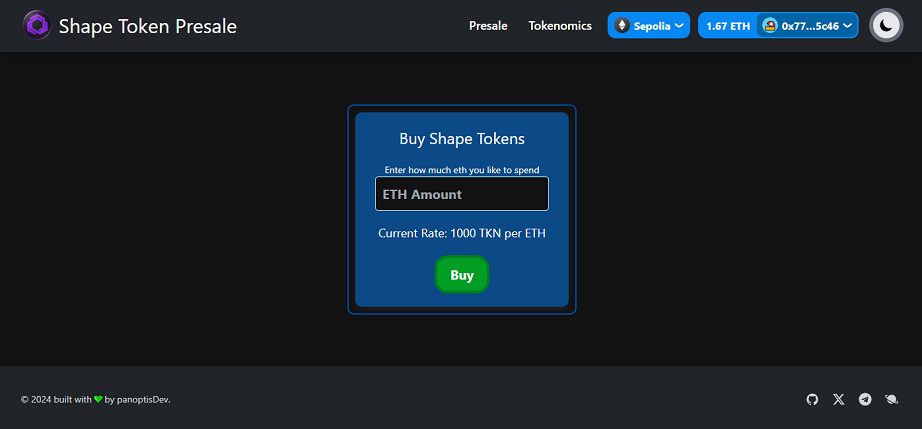

nvm use 20.12.2

yarn dev

RPC:https://polygon-amoy.drpc.org	

---
## two token swap

### Deployed Contracts
Token: 0xeaD27a6c0c43598A0a6A216c9EE0E0ED638659f6
EthSwap:0xac02AE41F32B2eb15725e83d791beE35D4b58002
alow swap contract to spend token and transfer token to swap contract
---
## presale contract
Token: 0x763F016d03eEa2653debB688D15C80583A6421E1
Presale:0xE9d667b42F94907fD39296c177e8aB0f4e3033a8
alow presale contract to spend token and transfer token to swap contract

Token:https://sepolia.etherscan.io/address/0x763F016d03eEa2653debB688D15C80583A6421E1#code
Presale:https://sepolia.etherscan.io/address/0xE9d667b42F94907fD39296c177e8aB0f4e3033a8#code
---

Token: https://sepolia.etherscan.io/address/0xeaD27a6c0c43598A0a6A216c9EE0E0ED638659f6#code

https://sepolia.etherscan.io/address/0xac02AE41F32B2eb15725e83d791beE35D4b58002#code

### Web3 Packages

- [ethers](https://docs.ethers.org/v5/)
- [rainbowkit](https://www.rainbowkit.com)
- [wagmi](https://wagmi.sh)

