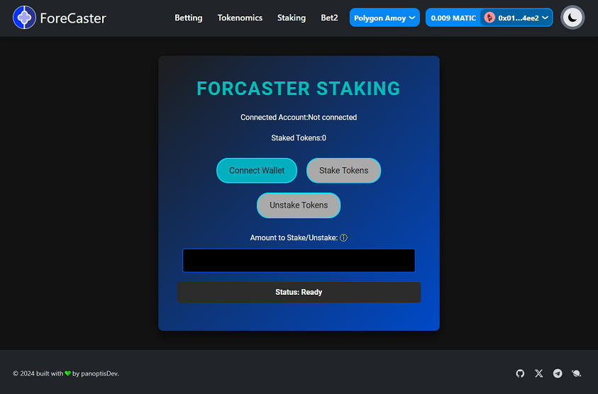
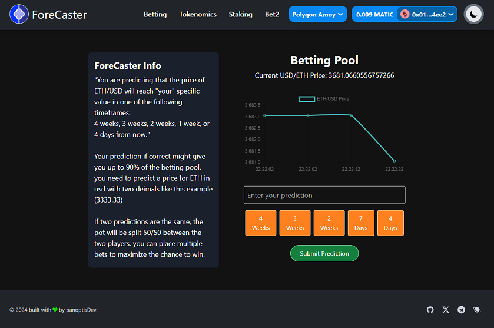

nvm use 20.12.2

yarn dev



RPC:https://polygon-amoy.drpc.org	

### ETH price API
https://www.diadata.org/
ETH: https://api.diadata.org/v1/assetQuotation/Ethereum/0x0000000000000000000000000000000000000000
MATIC: https://www.diadata.org/app/price/asset/Polygon/0x0000000000000000000000000000000000001010/
---
NFT URI:
https://crimson-formal-buzzard-132.mypinata.cloud/ipfs/QmZMZttQjgBuXfQYmnQ4CraHZ8Rsy6FYGRXwBMesZaqPoW

### Deployed Contracts
BettingPool: 0x022c8f039f4521C339Ac1c802b5c14aA5366C204
ETH/USD :0xF0d50568e3A7e8259E16663972b11910F89BD8e7


### ForcasterToken
ForcasterToken:0x67b205Ac5b4e35899145De95A40bEeCAbDf385c2
https://amoy.polygonscan.com/address/0x67b205Ac5b4e35899145De95A40bEeCAbDf385c2#code

### staking
SimpleStaking:0x42A01c339f71f6F81386360e0fF4EDcEee0e8674
https://amoy.polygonscan.com/address/0x42A01c339f71f6F81386360e0fF4EDcEee0e8674#code

timestamp in seconds: 1 month = 2592000 seconds
timestamp in seconds: 1 week = 604800 seconds
timestamp in seconds: 1 day = 86400 seconds
timestamp in seconds: 1 hour = 3600 seconds
---
Template for a decentralized application (dApp) built in [Next](https://nextjs.org).

- [TypeScript](https://www.typescriptlang.org)
- [Next 14](https://nextjs.org/blog/next-14)
- [TanStack Query](https://tanstack.com/query/latest)
- [Sass](https://sass-lang.com)
- [Tailwind CSS](https://tailwindcss.com)

### Web3 Packages

- [ethers](https://docs.ethers.org/v5/)
- [rainbowkit](https://www.rainbowkit.com)
- [wagmi](https://wagmi.sh)

---

## Available Scripts

### Development Mode

#### Start the Development Server

These commands start the application in development mode. Open [http://localhost:3000](http://localhost:3000) in your browser to see the result. The page auto-updates as you edit the file.

```bash
npm run dev
# or
yarn dev
# or
pnpm dev
```

### Production Build

#### Build the App for Production

These commands build an optimized version of the application for production, saved in the `.next` folder.

```bash
npm run build
# or
yarn build
# or
pnpm build
```

### Production Server

#### Start the Production Server

After building the application, use these commands to start the server in production mode.

```bash
npm run start
# or
yarn start
# or
pnpm start
```

### Code Quality

#### Run the Linter

Run these commands to start the linter, which helps maintain code quality and find any issues.

```bash
npm run lint
# or
yarn lint
# or
pnpm lint
```
----
i´ll write a frontend page that can handle the contract using this idea i wrote down:## simple frontend
create a simple frontedn for the contract.
add price feed api with real time price update for USD/ETH on polygon chain in a container. add a input field for the user to enter the price of $USD/ETH on a specific date and time pre defined by the frontend. add five blue buttons named button1, button2, button3, button4, button5. representing 4 weeks, 3 weeks, 2 weeks, 7 days, and 4 days in the future under the container on one line left to right. 

when a user clicks abuton for example 4 weeks in future button4, the user is prompted to enter the price of $USD/ETH on that specific date and time pre defined by the frontend.

add a green button for the user to submit the prediction.

the submited prediction will register the exact timestamp and price of $USD/ETH on that specific date and time qnd also the prediction 4 weeks in the future. and same for the other buttons but with ther respective values
----
import { contractAddress, contractABI } from '../lib/constants/contracts';